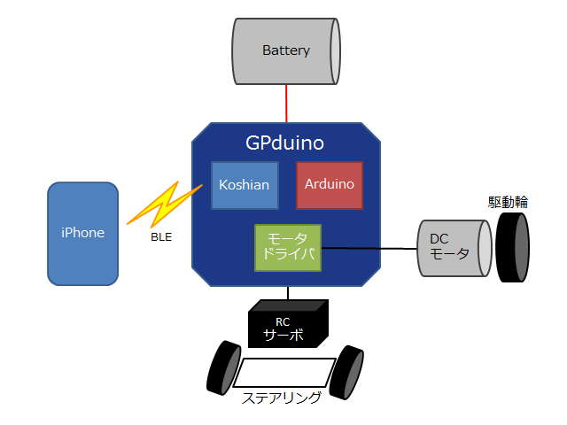
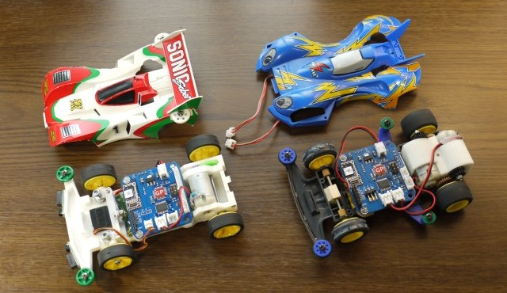

GPPropo (iOS版)
=========

## 概要
GPduinoを使ったBLEラジコンのためのプロポアプリです。（iOS版）
GPduinoは、Arduino+Konashi互換のBLEラジコン制御ボードです。  
GPduinoに関する詳細は、[GPduino特設ページ](http://lipoyang.net/gpduino)をごらんください。

プロポアプリは、下図のようなUIです。

ラジコンは、GPduinoとRCサーボやDCモータを組み合わせて作ります。  
下図はミニ四駆を改造して作ったラジコンです。

## 動作環境
### システム要件
* iOS 7.1 以降の端末
* Xcode 7以降
* GPduino
* DCモータとRCサーボを有するラジコンカー または DCモータ2個を有するラジコン戦車

### 確認済み環境

* iPod touch (第6世代), iOS 9.2.1, 4インチ(1134×640)

## ファイル一覧

* GPPropo/: プロポアプリのソース一式
* GPduino/ : GPduinoのファームウェア(Arduino互換のスケッチ)
* LICENSE: Apache Licence 2.0です
* README.md これ

## アプリの操作

* BLEボタンを押すと、接続するデバイスを選択する画面になります。
* ボタンの色は橙が未接続、黄色が接続中、青が接続済を示します。
* 見てのとおり、ラジコンプロポの要領で2本のスティックを操作します。

## 開発環境と依存ライブラリ
* このアプリは、Xcodeで開発されました。
* このアプリは、ユカイ工学の[Konashi iOS SDK](https://github.com/YUKAI/konashi-ios-sdk)に依存しています。
